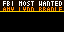

# Tidbyt FBI Most Wanted 🚨

**Author:** Rosie Domenech  
**Date:** April 2026  
**Description:** Live FBI Most Wanted ticker on your Tidbyt 64x32 LED display. Powered by the official FBI public API — no API key required.

---

## Preview



---

## Features

- 🚨 **Live data** from the official FBI Most Wanted public API
- 🔴 **Armed & Dangerous** persons shown in red with warning
- 🟡 **Reward amounts** displayed (e.g. $50K, $1M)
- 📋 **Charges** displayed for each person
- 🏛️ **Filter by FBI Field Office** — New York, LA, Chicago, DC, Miami, or All
- 🔄 **Updates every hour**
- No API key required

---

## Setup

```bash
git clone https://github.com/RosieDomenech/tidbyt-fbi-wanted.git
cd tidbyt-fbi-wanted
pixlet serve fbiwanted.star
```

### Push to Tidbyt
```bash
pixlet render fbiwanted.star
pixlet push \
  --api-token YOUR_API_TOKEN \
  --installation-id fbi-wanted \
  YOUR_DEVICE_ID \
  fbiwanted.webp
```

---

## Configuration

| Option | Values | Default |
|---|---|---|
| Number of Persons | 3, 5, 8 | 5 |
| Field Office | All, New York, LA, Chicago, DC, Miami | All |

---

## Data Source

Official [FBI Most Wanted API](https://api.fbi.gov/wanted/v1/list) — free and public, no registration required.
